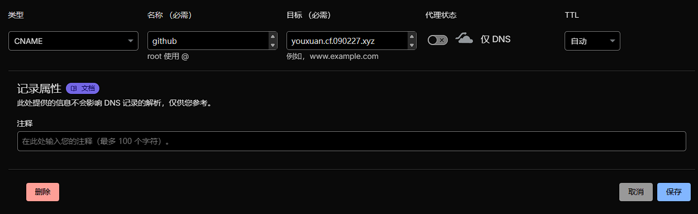
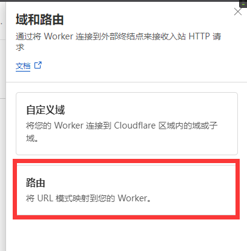
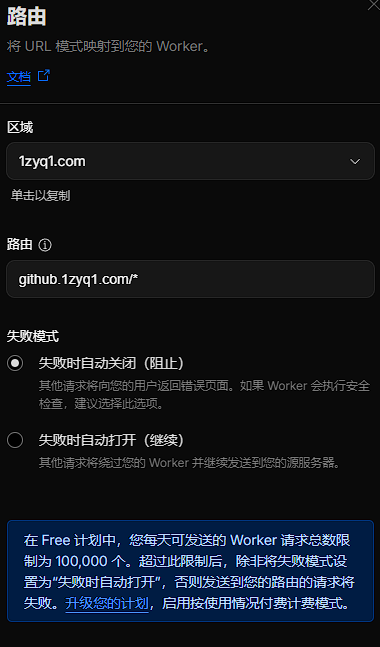
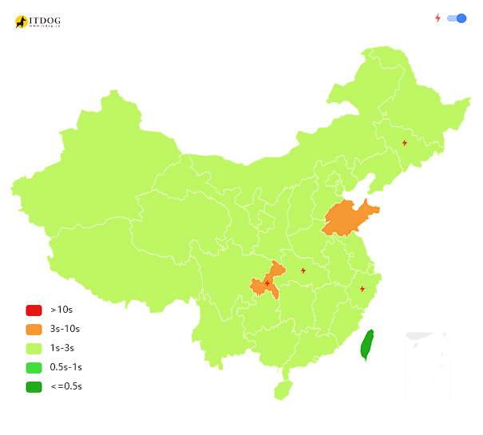

# 1. 创建Workers

 首先，你需要创建一个Cloudflare Workers项目。你可以在Cloudflare Dashboard中创建一个新的Worker，或者使用Cloudflare Workers CLI来创建。

# 2. 设置域名与优选Ip

 DNS记录内创建 {github.1zyq1.com} cname到 优选域名youxuan.cf.090227.xyz
### Ps: github.1zyq1.com替换成你希望访问Worker的域名

# 3. 创建Workers路由
添加 {github.1zyq1.com} Workers项目路由
路径：项目-设置-域和路由-添加-路由

创建路由github.1zyq1.com/* 切记域名后面一定要加/*

# 4. 对比
优选

未优选
