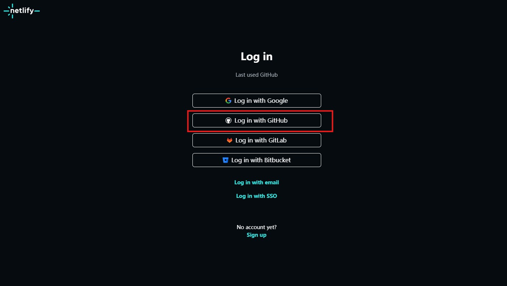
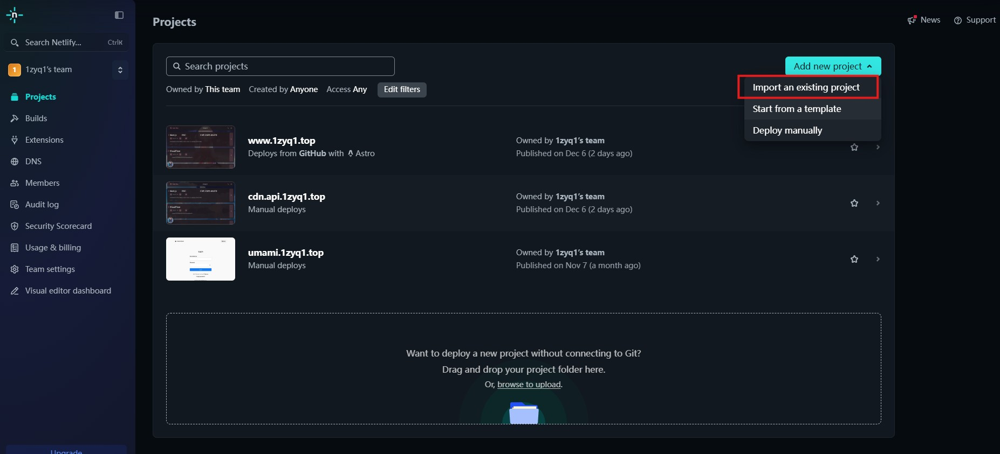
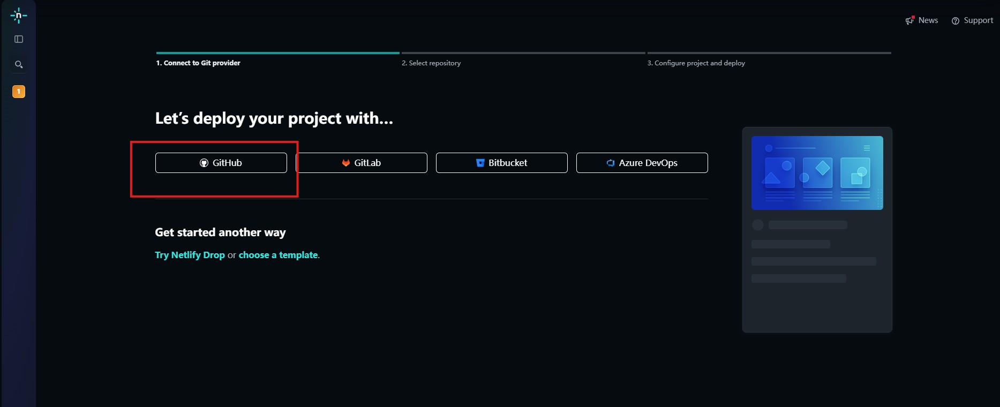
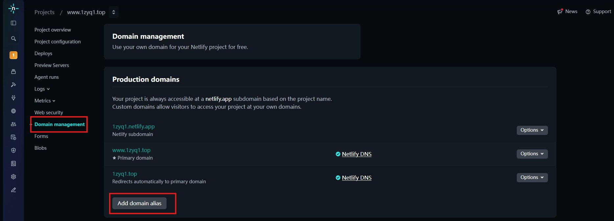

# 如何使用 Netlify 免费托管网站

Netlify 是一个非常强大的静态网站托管平台，它提供了免费托管、一键部署、CI/CD 等诸多优势，非常适合部署前端项目、静态生成器网站等。本文将详细介绍 Netlify 的优势以及如何使用它来托管你的网站，并以从 GitHub Pages 迁移为例进行说明。

## Netlify 的优势

1.  **免费托管，一键部署，100GB 存储容量**: Netlify 提供慷慨的免费套餐，包括免费托管、一键部署功能以及高达 100GB 的存储容量，对于个人项目和小型团队来说绰绰有余。
2.  **CI/CD (持续集成/持续部署)**: 当你将本地代码 `push` 到 GitHub、GitLab 等代码仓库时，Netlify 会自动触发构建和部署流程，实现代码的自动化部署，与 Vercel 的体验类似。
3.  **自定义域名/支持 HTTPS，免费 SSL 证书**: Netlify 支持自定义域名，并提供免费的 SSL 证书，让你的网站可以通过 `https` 安全访问。
4.  **HTTP Headers**: 你可以定制资源的 HTTP Header，从而为单页面应用（SPA）做“缓存优化”等性能提升。
5.  **CDN (内容分发网络)**: Netlify 将你的静态资源推送到全球各地的边缘节点，虽然在国内访问速度可能不如国内 CDN，但对于国外用户来说，访问速度通常不会有明显延迟。
6.  **HTTP Redirect/Rewrite**: 可以配置 `/api` 解决跨域问题，或者根据业务需求配置更多的路由重定向规则。
7.  **强大的辅助插件**: Netlify 提供了一些强大的插件，可以帮助你提升网站的性能和用户体验。

## 怎么使用 Netlify (以 GitHub Pages 迁移为例)

这里我们以将 GitHub Pages 迁移到 Netlify 上进行托管为例。

**前提条件**:
*   你有一个部署在 GitHub Pages 上的项目，并且已经生成了构建产物（例如 `dist` 或 `public` 目录）。
*   你有一个 GitHub 账号。

**步骤**:

1.  **登录 Netlify**:
    *   访问 [Netlify 官方网站](https://www.netlify.com/) (可能需要科学上网工具)。
    *   使用你的 GitHub 账号授权登录 Netlify。

2.  **新建站点**:
    *   在 Netlify 主页，点击 "New site from git" (从 Git 仓库新建站点) 按钮。

3.  **选择仓库**:
    *   点击 "Import an existing project" (创建新站点)。
    
    
    *   选择你想要部署的 Git 仓库。你可以选择授权 Netlify 访问你所有的 GitHub 仓库，或者指定一个特定的仓库。
    *   **注意**: 如果你的项目源码和构建产物（如 `dist` 目录）是分开管理的（例如，将构建产物放在一个单独的仓库中），请选择包含构建产物的那个仓库。如果源码和构建产物在同一个仓库，你需要确保 Netlify 知道哪个目录是构建产物。

4.  **配置构建选项**:
    *   **Build command**: 指定如何构建生成静态文件资源。对于大多数前端项目，这通常是 `npm run build`。
    *   **Publish directory**: 指定静态文件资源的目录。这通常是 `public`、`dist` 或你构建命令生成的目录。
    *   **注意**: 如果你的源码和构建产物是分开管理的，并且你直接导入了包含构建产物的仓库，那么你可能不需要填写 `Build command`，只需要指定 `Publish directory`。如果你的源码和构建产物在同一个仓库，并且你希望 Netlify 自动构建，那么这两个选项都需要正确配置。

5.  **部署成功**:
    *   一旦你正确导入了包含构建产物的目录文件，Netlify 通常会自动完成部署。
    *   **建议**: 最好只将本地打包构建后的项目文件（如 `dist` 目录）部署到 Netlify 上，而不是将完整的项目源码一同部署。

## 自定义域名

1.  **添加或注册域名**:
    *   在 Netlify 的站点管理面板中，找到 "Domain management" (添加或注册域名) 选项。
    *   你可以添加一个已有的域名，或者在 Netlify 上注册新域名。
    
2.  **域名解析**:
    *   添加域名后，Netlify 会提供相应的 DNS 记录信息。
    *   你需要在你的域名注册商（如阿里云、腾讯云、西部数码等）的控制台中找到 DNS 管理设置，并按照 Netlify 的指示配置 A 记录或 CNAME 记录。
    *   如果你之前在 Vercel 或其他平台解析过域名，操作流程会非常相似。

3.  **域名管理**:
    *   配置完成后，等待 DNS 生效，你的网站就可以通过自定义域名访问了。

## 安装插件

为了进一步提升网站性能，Netlify 提供了一些强大的辅助插件。你可以在 Netlify 的插件市场中查找并安装适合你项目的插件，例如用于 SEO 优化、性能提升等。

## 总结

使用 Netlify 部署网站非常简单且功能强大，它支持部署 VuePress、React、Vue.js、Gatsby、Angular、Next.js 等多种前端框架和静态生成器。Netlify 的 CI/CD 功能和免费托管使其成为个人博客、项目展示页面的理想选择。

**与其他托管方案的对比**:

*   **GitHub Pages**: 免费，简单易用，但 CI/CD 功能相对较弱，自定义配置选项较少。
*   **Vercel**: 与 Netlify 非常相似，提供免费套餐，功能强大，尤其适合 Next.js 等框架。
*   **国内云厂商 (阿里云、腾讯云等)**:
    *   **静态网站托管**: 通常会收取一定的存储和 CDN 费用，但国内 CDN 访问速度可能更快。
    *   **云服务器 (ECS/CVM)**: 提供更强大的灵活性和控制力，但需要自行配置和维护，成本也更高。

**为什么选择 Netlify/Vercel 等？**

对于个人博客或学习项目，使用静态网站生成器配合 Netlify、Vercel 或 GitHub Pages 进行托管，可以极大地简化部署流程并降低成本。如果你需要部署更复杂的应用，或者对国内访问速度有较高要求，可以考虑国内云厂商的静态网站托管或云服务器。

作者的经验表明，尝试不同的托管方案（如虚拟主机、静态网站托管、云服务器等）能够帮助我们更好地理解它们之间的差异，并在未来的建站和应用部署中选择最合适的方案。掌握多种技术，就像拥有更多的选择，能够让你在面对不同需求时游刃有余。
