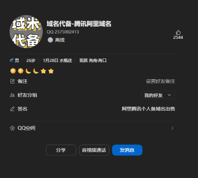
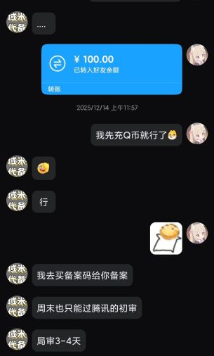

## 起因
我想着给我的前域名（1zyq1.top）备案但因为年龄原因被拒绝了，所以我就找了一个人代备案

并且还转了钱

## 经过
对方以“备案需要将域名转移至其腾讯云账户”为由，要求我进行操作。当时未多加怀疑，便同意了转移。起初，备案流程似乎正常进行，但备案完成后，对方开始失联，消息不再回复，最终将我拉黑。

## 教训与总结
希望各位以后一定要谨慎，不要随便相信别人，不要随便转钱，一定要自己操作，不要让别人代操作
## 对方信息（请谨慎核实）
Q: 2575002413

[B站](https://space.bilibili.com/3546823872481570) 

银行卡（招商银行）: 6214838983475171

持卡人: 王世林

腾讯云账户ID: 100029978297

APPID: 1317160404